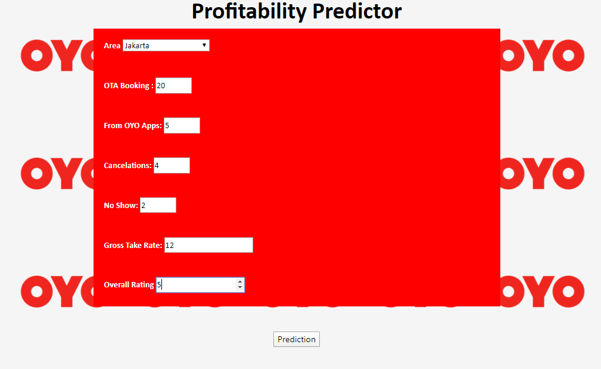
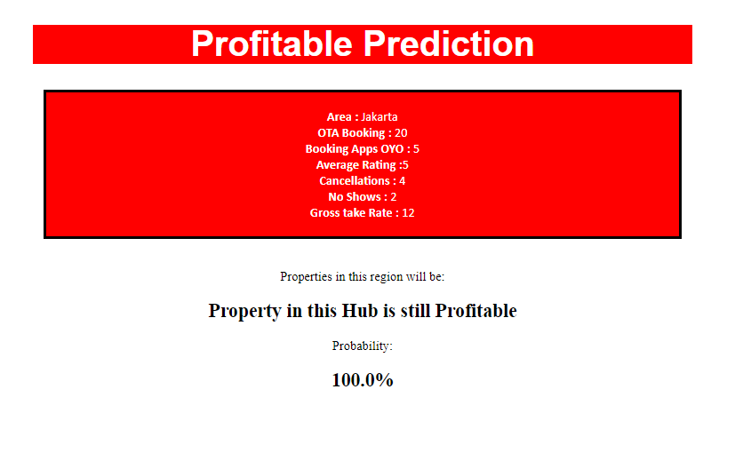
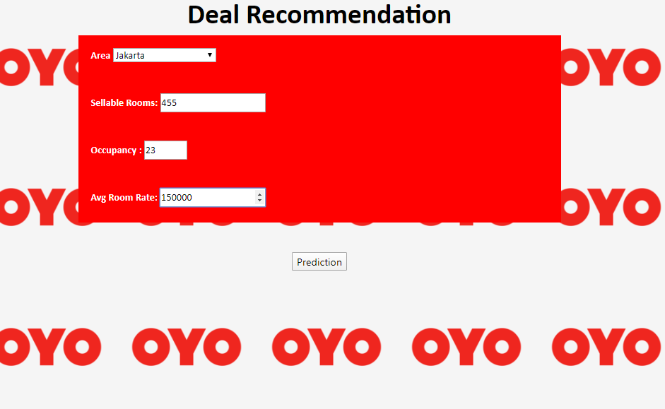
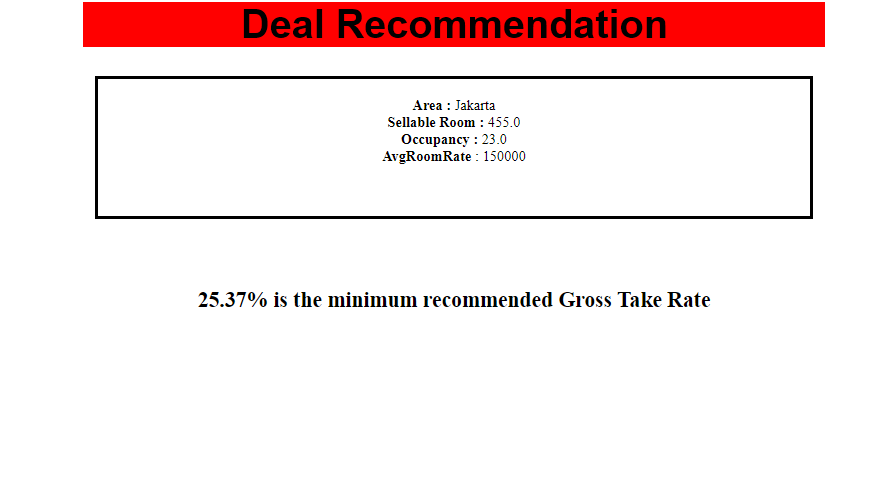

# Determining Area Profitability and Deal Recommendation 
### by : Bintang Ramadhan

Dataset for this project is from company dataset, OYO. 
OYO (stylised as OYO), also known as Oyo Homes & Hotels, is an Indian hotel chain. It is the world's third-largest and fastest-growing hospitality chain of leased and franchised hotels, homes and living spaces.

Features :
- Year 
- Month 
- Oyo Id 
- Hub 
- City 
- Cluster 
- SRNs = Sellable Room 
- GMV = Gross Merchandising Value
- OCC = Occupany
- OTA = Online Travel Agent
- MM = Avearage Rating
- App = Booking via apps
- Web = Booking via website
- Direct = Direct to property
- Walk_in = walk in booking
- Rest = Others
- ARR = Average Room Rate
- Revpar = Revenue per available rooms
- GTR = Gross Take Rate
- NTR = Net Take Rate
- MG_Loss = Minimum Guarantee Loss

#### Business Problems :

OYO Indonesia fired more than 1000 employees and closed more than 10000 property partner in Indonesia in order to decrease operating cost, filtering the unprofit property and focus on profitable properties in certain area. While OYO goals on company growth and valuation is :by dealing with new (profitable) property. 
[Link to News](https://www.cnbcindonesia.com/tech/20200114151313-37-129926/demi-cetak-profit-startup-hotel-oyo-phk-1000-karyawan)

What is PROFITABILITY?

Profitability is ability of a company to use its resources to generate revenues in excess of its expenses. In other words, this is a company’s capability of generating profits from its operations.

PROPERTY PROFITABILITY ISSUES :
- Bad Review in Online Travel Agent
- Fraud
- Bad service
- Rarely ask for review
- Operational issues
- High Commision
- Low Gross Take Rate
- Low App Contribution
- Low Price
- Campaign
- Minimum Guarantee Loss

Determining the profitability in certain areas :

**Home** :

**Result** :

After filtering the unprofitable property in certain areas, OYO need to deal with new properties. But the problem is, Business Development of OYO have no idea of giving the best take rate for OYO it self, to prevent unprofitable and loss. 

Machine Learning for deal recommendation by predicting the best Gross Take Rate, by Sellable Room, Average Room Rate and Occupancy(in  the same area) :

**Home** :

**Result** : 

